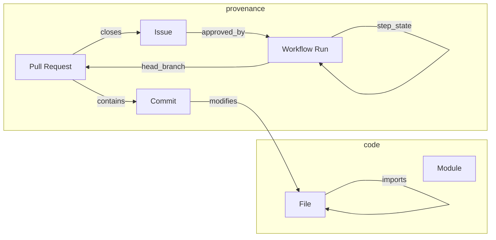

# Knowledge graph plan — git provenance → multi-repo auto-development

Roadmap for evolving repo-intel from a **static import graph + ticket pipeline** into a
**git-provenance knowledge graph** users navigate to explore PRs, commits, CI runs, and
reachability — eventually applied to **any monitored repository**.

**Status:** planning (June 2026)  
**Default scan target:** this checkout (`ticket-sys`) unless `TARGET_REPO` overrides  
**Research:** `docs/inspiration.md` + provenance tools below (GitHits auth unavailable; web/OSS review)

---

## Vision

One graph where a human (or agent) can:

1. Start at a **module** or **file** and see what commits, PRs, issues, and Actions runs touched it
2. Follow **reach** edges (imports, co-change, same-PR, same-issue) in a force-directed view
3. See **CI state** on nodes (queued → running → success/failure) tied to branch/PR/commit
4. Switch **monitored repo** (`TARGET_REPO`) while keeping intel artifacts in this checkout
5. Run the **RADAR → approve → executor** loop against external repos with the same graph contract



---

## Current state (what we have)

| Layer | Implementation | Gap |
| --- | --- | --- |
| Code structure | `scan.py` → files, import edges, churn | No commit/PR nodes in graph DB |
| GitHub intel | `github_intel.py` → PRs, issues, pipeline stages | Merged PRs only; no commit→file graph index |
| Pipeline UI | Ticket columns, agent run JSON | Not a unified provenance graph |
| CI visibility | Workflow list + job steps (live API) | Not persisted in `index.json` / not linked to graph nodes |
| Multi-repo | `TARGET_REPO` + `meta.intel_root` | Default was external; now self-scan first |

**Contract:** `docs/index.json` remains the UI/API source of truth (additive schema only).

---

## Inspiration (provenance-focused OSS)

| Project | What to borrow |
| --- | --- |
| [FalkorDB/RepoGraph](https://github.com/FalkorDB/RepoGraph) | Developer→commit→file→module graph; bus factor, blast radius, co-change coupling; D3 force UI |
| [GitCortex](https://github.com/bharath03-a/gitcortex) | Incremental index on every commit; branch-aware graph; MCP query surface; `gcx viz` force graph |
| [Noumenon](https://github.com/leifericf/noumenon) | Pipeline stages: import → enrich → analyze; commits/files/authors as first-class entities |
| [git-mind / git-warp](https://github.com/flyingrobots/git-mind) | Git-native provenance; semantic diff; issues/tasks linked to graph with replay |
| [emerge](https://github.com/glato/emerge) / [CodeMap](https://github.com/polprog-tech/CodeMap) | Hotspot + coupling metrics (already partially in RADAR) |

**Our constraint (non-negotiable):** scanner/index refresh stays **deterministic and LLM-free**; LLMs only in RADAR drafting, executor, and optional enrich stage.

---

## Target schema (index v3 — additive)

New top-level sections (illustrative — bump `schema_version` when stabilized):

```json
{
  "schema_version": 3,
  "meta": {
    "intel_root": "/path/to/ticket-sys",
    "scan_target": "/path/to/monitored/repo",
    "scan_target_is_self": true
  },
  "graph": {
    "nodes": [
      {"id": "file:scan.py", "kind": "file", "path": "scan.py", "loc": 691},
      {"id": "commit:abc1234", "kind": "commit", "sha": "abc1234", "message": "...", "date": "..."},
      {"id": "pr:34", "kind": "pull_request", "number": 34, "state": "MERGED"},
      {"id": "run:27482269917", "kind": "workflow_run", "name": "test", "status": "completed"}
    ],
    "edges": [
      {"source": "commit:abc1234", "target": "file:scan.py", "type": "modifies"},
      {"source": "pr:34", "target": "commit:abc1234", "type": "contains"},
      {"source": "file:a.py", "target": "file:b.py", "type": "imports"},
      {"source": "file:a.py", "target": "file:c.py", "type": "co_changed", "weight": 3}
    ]
  },
  "reach": {
    "imports": "existing edges[]",
    "co_change": "computed from git log --name-only",
    "same_pr": "from PR commit lists"
  }
}
```

SQLite (`docs/index.db`) mirrors nodes/edges for analytical queries (scan history, reach BFS).

---

## Phased implementation

### Phase KG-1 — Provenance ingest (deterministic)

**Goal:** Commits and PRs become graph nodes linked to files.

| Task | Owner | Output |
| --- | --- | --- |
| `scripts/provenance_graph.py` | new | Build `graph.nodes` / `graph.edges` from git log + existing PR intel |
| Extend `github_intel.py` | modify | Open + merged PRs; attach commits→files (already partial) |
| Co-change edges | new | Pair files touched in same commit (RepoGraph-style coupling signal) |
| Tests | new | Fixture repo with known commit/file/PR linkage |

**Acceptance:** `index.json` contains commit nodes for last N commits and `modifies` edges to files.

### Phase KG-2 — CI run nodes & state

**Goal:** Actions runs/steps linked to branches, PRs, and pipeline tickets.

| Task | Output |
| --- | --- |
| Persist workflow runs in index | `workflow_runs[]` already exists — add stable `run_id` nodes |
| Link `issue-N` branch → executor run → verify step → PR open | edges in `graph` |
| Dashboard: click workflow run → highlight PR/commits/files | UI |

**Acceptance:** Selecting a ticket in pipeline highlights related workflow run node and changed files on force graph.

### Phase KG-3 — Unified force graph UI

**Goal:** Replace/supplement module-only graph with **layer toggles**.

| Layer | Node types | Edge types |
| --- | --- | --- |
| Structure | file, module | imports |
| Provenance | commit, PR, issue | modifies, contains, closes |
| Operations | workflow_run, workflow_step | triggered_by, head_branch |

Interactions (from RepoGraph / GitCortex):

- Click file → show incoming commits + PRs + blast-radius preview (1-hop imports + co-change)
- Click commit → highlight files; show PR strip (exists today — generalize)
- Click PR → issue + CI runs + file set
- **Reach mode:** BFS from selected node with depth slider

**Acceptance:** User navigates PR #34 → commits → files without leaving dashboard.

### Phase KG-4 — Reach & blast queries (stdlib + SQLite)

**Goal:** Answer “what breaks if I change X?” without LLM.

- BFS on import edges + co-change edges (weighted)
- Expose `scripts/reach_query.py --from scan.py --depth 2`
- Optional: bus-factor style author→file edges from `git log --follow`

**Acceptance:** CLI and dashboard agree on 2-hop reach set for a fixture file.

### Phase KG-5 — Multi-repo federation

**Goal:** Analyze and develop **other repos** with the same toolchain.

| Mechanism | Notes |
| --- | --- |
| `TARGET_REPO=/path/to/other` | Scan target switch; `docs/` still in ticket-sys |
| `meta.github_repo` mapping | gh remote slug for intel vs scan target (may differ) |
| Per-target index snapshots | `docs/targets/<slug>/index.json` or single index with `scan_target` key |
| Executor | Already branch-per-issue; works on any GitHub repo this tool points at |

**Acceptance:** Scan `hhl_site`, see its module graph; pipeline/RADAR still operate on ticket-sys GitHub issues referencing cross-repo work (or per-repo issue templates later).

### Phase KG-6 — Automated development loop (existing + graph-aware)

**Goal:** RADAR findings use graph reach/co-change; executor plans cite blast radius.

- RADAR rules: flag files with high co-change but no test import edge (already started)
- Agent plan step: include reach subgraph in `plan.json`
- Executor prompt: “minimize blast radius; touch only files in plan reach set”

**Acceptance:** Approved issue produces PR; graph shows new commit nodes linked within one refresh cycle.

---

## Recommended build order

Aligns with operator priorities:

1. **Now:** Default `TARGET_REPO` = this repo; merge plan doc (this PR)
2. **KG-1** — provenance ingest (highest leverage for “see PR/commit on graph”)
3. **KG-3** — unified UI (user-visible navigation)
4. **KG-2** — CI nodes (ties pipeline board to graph)
5. **KG-4** — reach queries (powers smarter RADAR)
6. **KG-5** — multi-repo (your `hhl_site` use case)
7. **KG-6** — graph-aware agents

Estimated effort: KG-1+3 ≈ 1–2 weeks; full vision ≈ 6–8 weeks part-time.

---

## Technical decisions (proposed)

| Decision | Choice | Rationale |
| --- | --- | --- |
| Graph storage | JSON + SQLite in `docs/` | Matches today; no FalkorDB/Kuzu dependency yet |
| Graph DB later? | Optional export to FalkorDB | If reach queries exceed SQLite comfort |
| Force layout | D3 (existing) | Already in dashboard template |
| CI data | gh CLI + poll (local); Actions API in CI | Same as dashboard_api today |
| Schema bumps | Additive v3 | AGENTS.md contract |

---

## Open questions

1. **Single vs multi-index:** One `index.json` per scan target or one merged mega-index?
2. **Pages hosting:** Provenance graph on GitHub Pages (static) vs local-only live CI?
3. **GitHits:** Run `githits login` to deepen comparative code reads on RepoGraph/GitCortex ingest pipelines.
4. **Issue namespace:** One GitHub repo for all targets’ tickets, or per-target issue repos?

---

## Next PRs (suggested)

| PR | Scope |
| --- | --- |
| `docs/knowledge-graph-plan` | This document + `.env.example` default (current) |
| `feat/provenance-ingest` | KG-1: `provenance_graph.py` + schema v3 nodes |
| `feat/graph-ui-layers` | KG-3: layer toggles + PR/commit navigation |
| `feat/ci-graph-nodes` | KG-2: workflow nodes in index |

---

## References

- `docs/inspiration.md` — initial OSS survey
- `docs/RUNBOOK.md` — operator commands
- `HANDOFF.md` — original phase 0–6 spec
- `scripts/pipeline_lib.py` — ticket stage inference (feeds KG-2)
